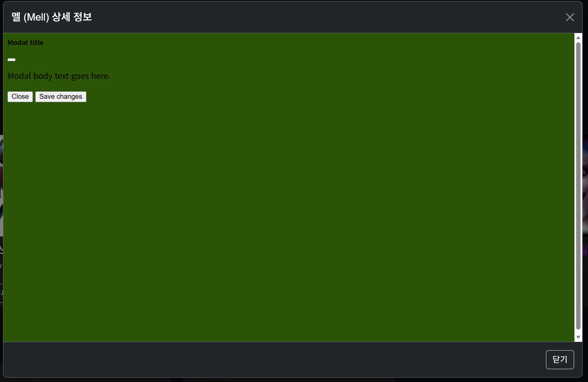
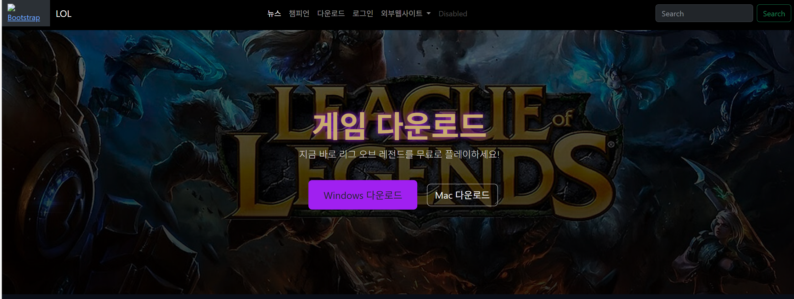
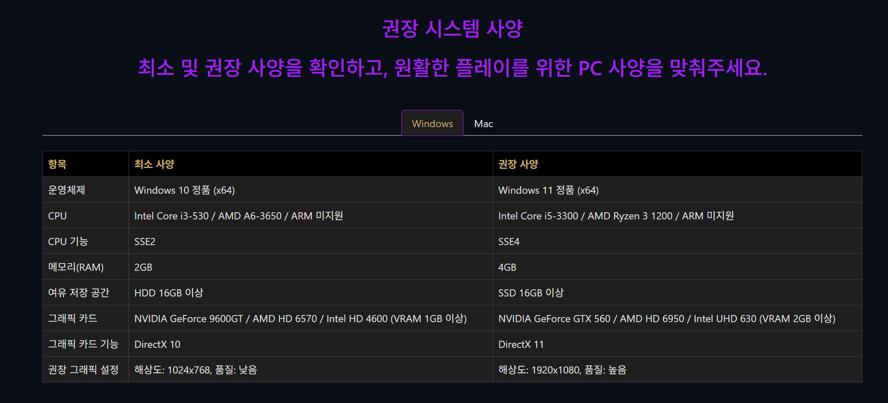
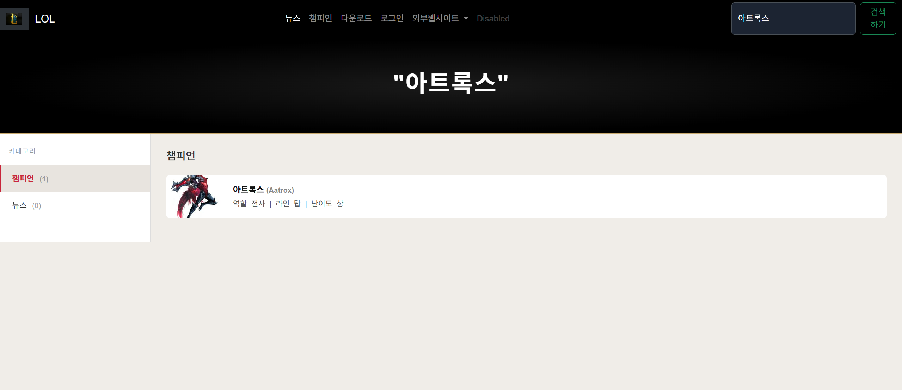
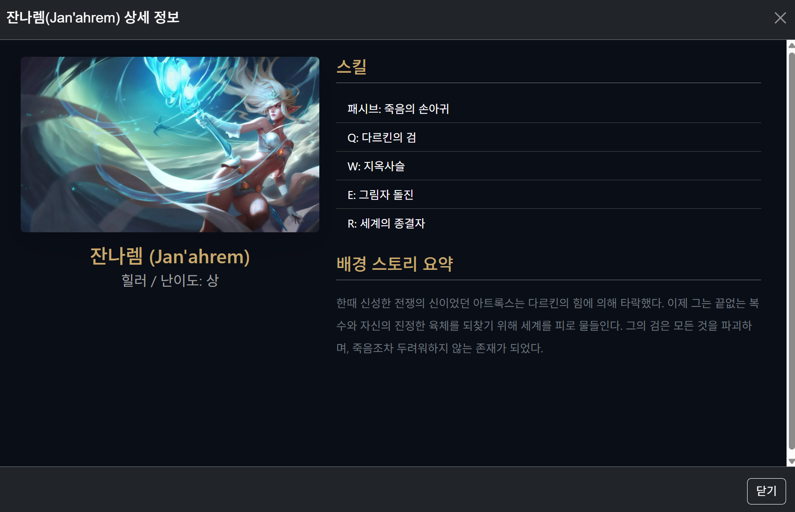
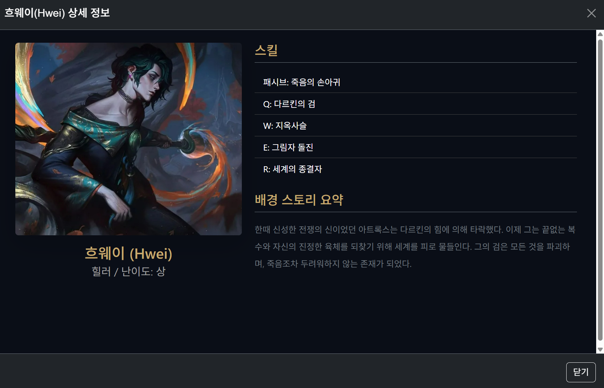
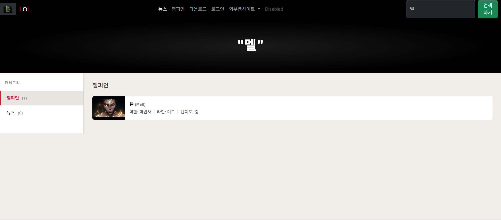
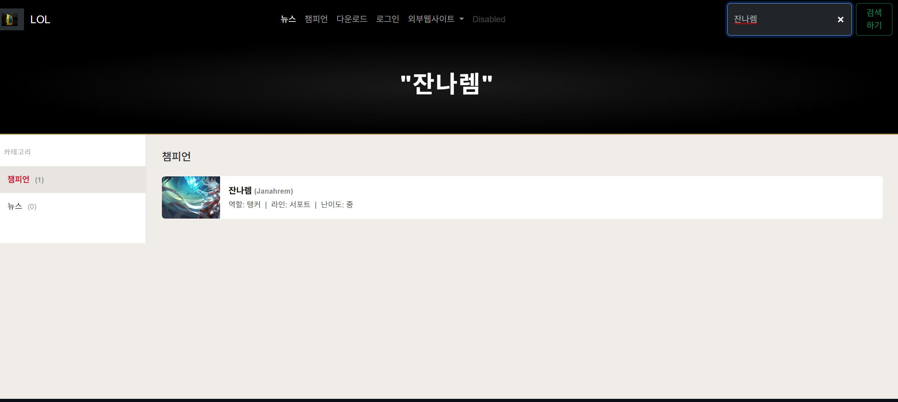
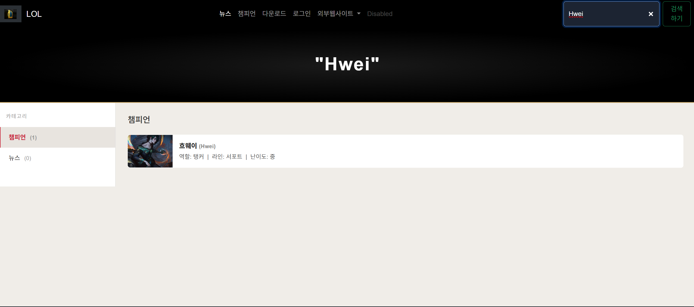

# code-with-quarkus
## Running the application in dev mode

You can run your application in dev mode that enables live coding using:

```shell script
./mvnw quarkus:dev
```

># quarkus 프로젝트 시작! (학번 :20230987 이름 : 노대영 )
매 주 수업 내용을 정리하자.
## 4주차 수업 내용
실습 1 : 메인 화면 구성(2주차)
실습 2 : 아트록스 카드를 만든 후 마우스를 갖다대면 그림자 색이 생기는 것을 만들었다.(3주차)
실습 3 : 교수님이 주신 리소스 파일 코드를 index.html파일에 붙여 넣고 아트록스 사진을 변경
실습 4 : navBar(내비게이션 바)를 Bootstrap에서 코드를 갖고와서 index에서 바를 바꾼 후 바 안에 글씨를 수정하였다.
실습 5 : 내비게이션 바에서 href = / target = "_blank" 에 주소를 입력시켜 바에서 웹사이트를 눌렀을때 다른 주소로 연결이 되게끔 
실습 6 : 아트록스 카드에 상세 보기를 넣고 상세 보기를 누르면 다른 창이 열리는 것(모달)을 생성


# 4주차 과제 테스트
1.로고추가, 로고 이름 변경
2.navBar에서 글자들을 가운데 정렬
3.새로운 멜이라는 캐릭터 추가 후 아트록스와 같이 사진변경,상세설명 추가,모달 추가 후 배경 변경 하였다.


 !
 !
 !


#5주차 내용
1.내비게이션 바에서 다운로드선택시 다운로드 창을 만듦(main_page폴더,)
2.다운로드 페이지에서 맥,윈도우 탭이 나뉘어져있고 다운로드창에 사진을 입혔다.
3.다운로드창에 사양표를 넣음




# 6주차 내용
1. <!-- (자바 스크립트에서 실행되면 해킹의 위험성이 큼) -->
    <script>      
        window.onload = function() {  //페이지에 누르면 바로 실행됨.
            alert("메인 페이지 로딩 완료"); 
        }
    </script>
2. onclick = 누르면 실행됨.
3. 인라인 함수: 가장 보안에 취약한 방식, 웹사이트에서 차단가능
4. .trim() 앞뒤 공백 제거
7. class = 디자인
6. id:보유 식별자(해당 폼  페이지의 고유값)
9. blank: 새창 띄우기(repit)
10. document.getElementById(): 자바 스트립트 처리할떄 많이 사용됨.
11. var: 어디든지 사용가능, let: 재할당 받음, const: 상수 할당 받음.
-전체내용 요약: 창 안에서 검색창 폼에서 search 파일을 만들어 검색이 되어 연결 링크까지 가도록했다.
-검색창에 검색하는 연결 스크립트는 <script src="js/test.js"></script> 마지막에 들어감.


# 7주차 수업내용
1. 서치 폼을 만들어 캐릭터 검색을 하면 웹페이지에 들어가 있는 캐릭터 정보가 뜨게끔 만듦.
2. main.css파일을 css폴더에 넣은 후 index 파일에서 연결링크를 넣은 후 main.css 파일에서 아트록스를 관리 할 수 있게 해줌.
3. 검색에서 없는 검색어는 그 검색어에 맞춰 그 검색어 출력 후 각 뉴스,캐릭터에 없다는 글을 뜨도록 설정을 하고 이벤트를 넣어 챔피언이 있는지 없는지 관리 할 수 있도록 하였다.


# 7주차 과제
-modal창 구현



-새로 추가했던 캐릭터를 검색 후 상세 정보가 나오게 함. 




<video controls src="20260415-0954-57.4169456.mp4" title="Title"></video>

# 8주차 수업내용
1. 네이게이션바에서 토글을 연결해 글자를 선택하면 다크,화이트 모드로 변경 되도록 설정
2. DB의 연결과 현재 내가 만든 코드들의 파일 상태 확인가능
3. mysql은 데이터를 주고 받기 위해서 3306으로 설정
