# code-with-quarkus

## Running the application in dev mode

You can run your application in dev mode that enables live coding using:

```shell script
./mvnw quarkus:dev
```

> # quarkus 프로젝트 시작! (학번 :20230987 이름 : 노대영 )
>
> 매 주 수업 내용을 정리하자.

## 4주차 수업 내용

실습 1 : 메인 화면 구성(2주차)
실습 2 : 아트록스 카드를 만든 후 마우스를 갖다대면 그림자 색이 생기는 것을 만들었다.(3주차)
실습 3 : 교수님이 주신 리소스 파일 코드를 index.html파일에 붙여 넣고 아트록스 사진을 변경
실습 4 : navBar(내비게이션 바)를 Bootstrap에서 코드를 갖고와서 index에서 바를 바꾼 후 바 안에 글씨를 수정하였다.
실습 5 : 내비게이션 바에서 href = / target = "\_blank" 에 주소를 입력시켜 바에서 웹사이트를 눌렀을때 다른 주소로 연결이 되게끔
실습 6 : 아트록스 카드에 상세 보기를 넣고 상세 보기를 누르면 다른 창이 열리는 것(모달)을 생성

# 4주차 과제 테스트

1.로고추가, 로고 이름 변경
2.navBar에서 글자들을 가운데 정렬 3.새로운 멜이라는 캐릭터 추가 후 아트록스와 같이 사진변경,상세설명 추가,모달 추가 후 배경 변경 하였다.

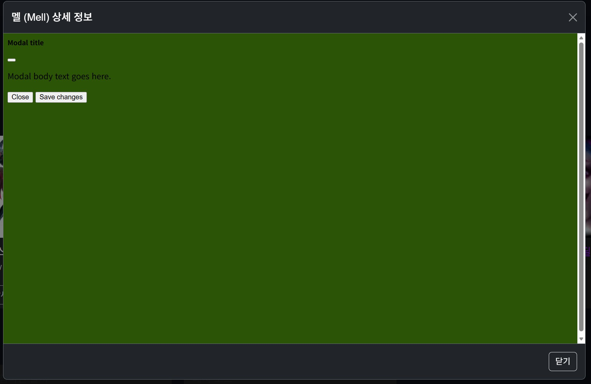 !
 !
 !


#5주차 내용 1.내비게이션 바에서 다운로드선택시 다운로드 창을 만듦(main_page폴더,) 2.다운로드 페이지에서 맥,윈도우 탭이 나뉘어져있고 다운로드창에 사진을 입혔다. 3.다운로드창에 사양표를 넣음
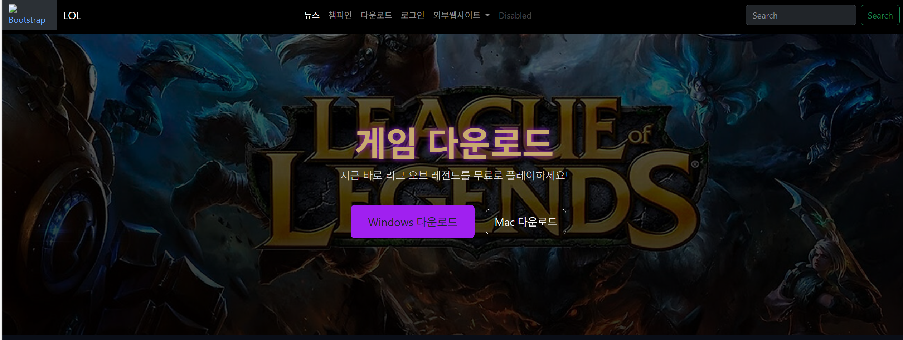
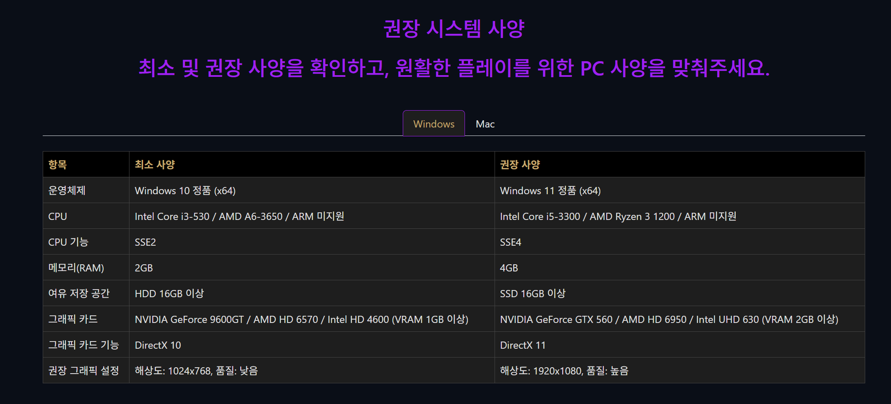

# 6주차 내용

1. <!-- (자바 스크립트에서 실행되면 해킹의 위험성이 큼) -->
<script>      
    window.onload = function() {  //페이지에 누르면 바로 실행됨.
        alert("메인 페이지 로딩 완료"); 
    }
</script>
2. onclick = 누르면 실행됨.
3. 인라인 함수: 가장 보안에 취약한 방식, 웹사이트에서 차단가능
4. .trim() 앞뒤 공백 제거
5. class = 디자인
6. id:보유 식별자(해당 폼 페이지의 고유값)
7. blank: 새창 띄우기(repit)
8. document.getElementById(): 자바 스트립트 처리할떄 많이 사용됨.
9. var: 어디든지 사용가능, let: 재할당 받음, const: 상수 할당 받음. -전체내용 요약: 창 안에서 검색창 폼에서 search 파일을 만들어 검색이 되어 연결 링크까지 가도록했다. -검색창에 검색하는 연결 스크립트는 <script src="js/test.js"></script> 마지막에 들어감.

# 7주차 수업내용

1. 서치 폼을 만들어 캐릭터 검색을 하면 웹페이지에 들어가 있는 캐릭터 정보가 뜨게끔 만듦.
2. main.css파일을 css폴더에 넣은 후 index 파일에서 연결링크를 넣은 후 main.css 파일에서 아트록스를 관리 할 수 있게 해줌.
3. 검색에서 없는 검색어는 그 검색어에 맞춰 그 검색어 출력 후 각 뉴스,캐릭터에 없다는 글을 뜨도록 설정을 하고 이벤트를 넣어 챔피언이 있는지 없는지 관리 할 수 있도록 하였다.
   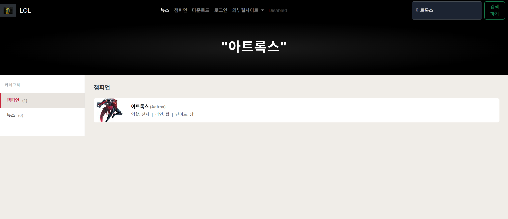

# 7주차 과제

-modal창 구현
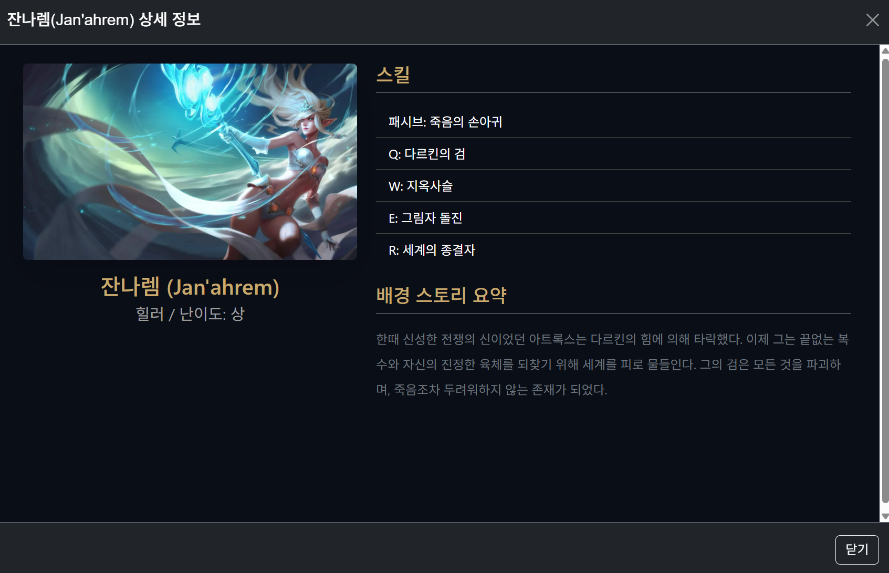
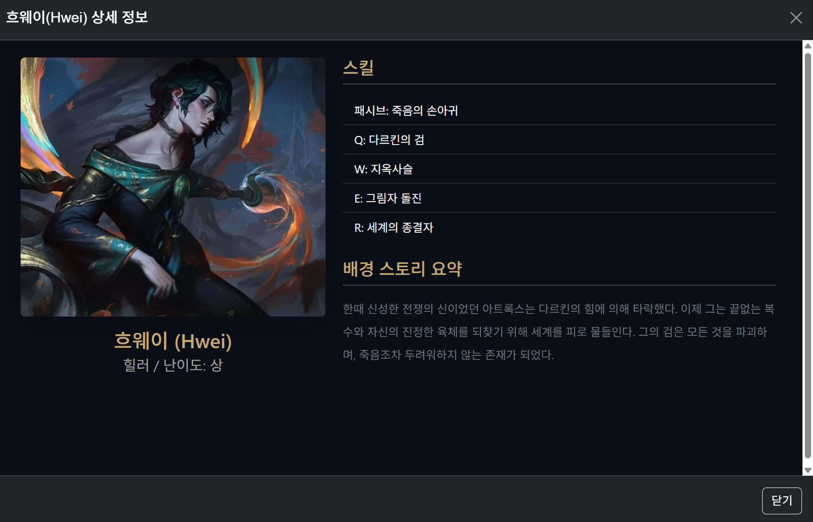

-새로 추가했던 캐릭터를 검색 후 상세 정보가 나오게 함.
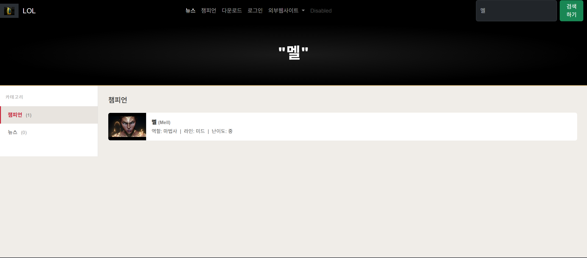
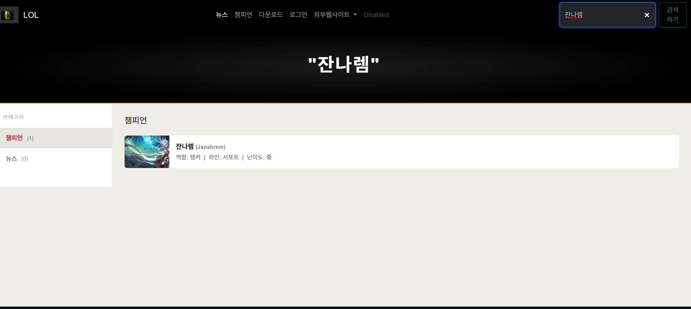
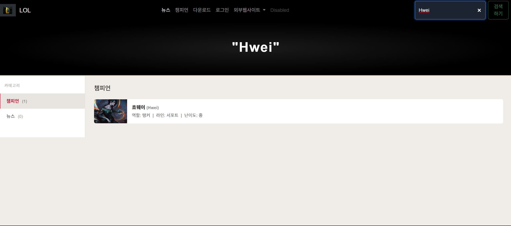

<video controls src="20260415-0954-57.4169456.mp4" title="Title"></video>

# 9주차 수업내용

1. 네이게이션바에서 토글을 연결해 글자를 선택하면 다크,화이트 모드로 변경 되도록 설정
2. DB의 연결과 현재 내가 만든 코드들의 파일 상태 확인가능
3. mysql은 데이터를 주고 받기 위해서 3306으로 설정

# 9주차 과제

사진과 같이 검색 하였을 때 캐릭터가 나오고 상세버튼을 눌렀을 때 모달창이 뜨게끔 하였다.
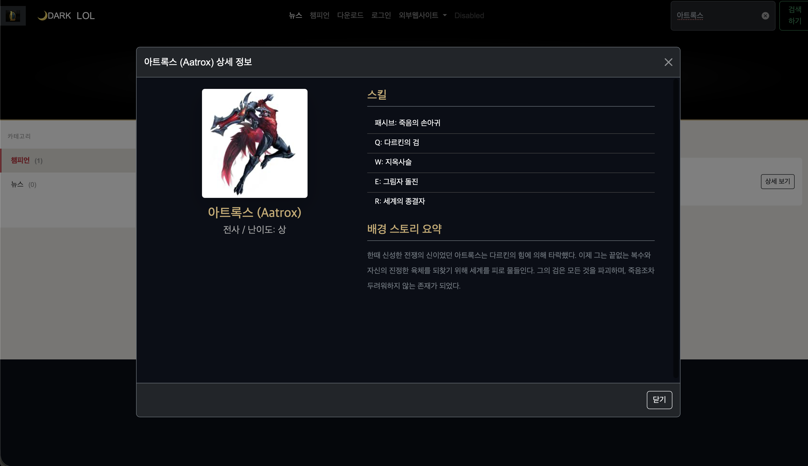
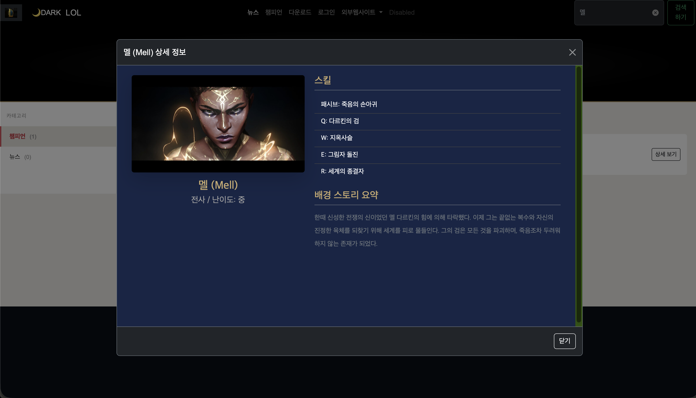
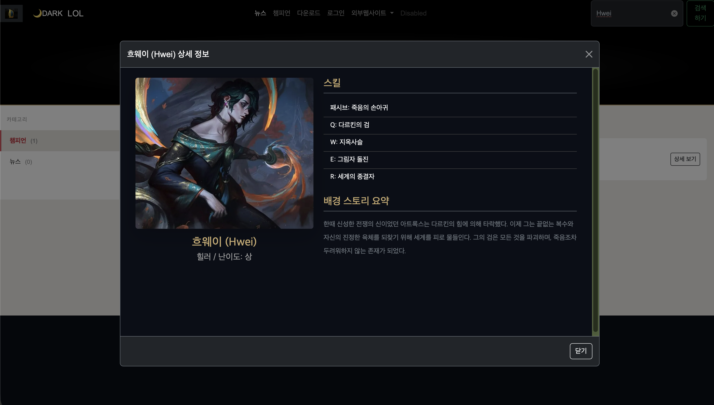

# 10주차-1

1. 웹 보안: 쿠키(웹브라우저에 저장) ex:장바구니
2. 개인정보는 백엔드 자체 DB에 저장이 된 후 꺼내올 수 있도록 해야함.(다운로드 서버 창과 다름)
3. 로그인 창만든 후 로그인 창을 만들고 네비게이션바를 그대로 갖고 와서 로그인 파일에 넣는다.
4. AuthResource.java파일에 login.html 파일에서 값을 받으면 파라미터가 되도록 값을 다시 받는 코드를 넣는다.
5. extend= panacheEntity라이브러니에서 만들어진 함수를 갖다 쓸 수 있다.
6. SessionConfig를 만들어야지 실시간으로 사람이 쓰고 있는지 검사하는 것.
7. 로그인 폴더를 만들어 기존 index
   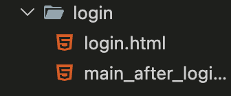

# 10주차-2

1.전 주에 나간 10-1내용을 이어서 로그인을 할 때 DB에서 연동이 되고 실제 사람이 로그인을 할 때 아이디 중복 등 체크하여 로그인이 가능한지 판단 하는 것을 나감.
2.DB와 프론트,백엔드의 관계를 간단하게 배우면서 계층을 나눠 오류가 발생하였을 떄 좀 더 해결하기 편하도록 나눴음.

# 10주차 요약(중요 개념)

세션 방식: 로그인 정보를 서버 메모리에 저장, 클라이언트는 세션 ID(쿠키)만 보유
JWT 방식: 토큰을 클라이언트(브라우저)에 저장, 확장성 높지만 탈취 시 위험
도메인 패키지 구조: 계층형보다 도메인형(champion/, login/, common/)이 응집도 높고 충돌 최소화
HTTP 상태코드: 200(성공), 302(리다이렉트/POST유지), 303(리다이렉트/GET전환), 404(없음)

# 10주차 과제

1. download.css에 다크,화이트 모드 코드를 추가하여 로그인창과같이 만들었음(download.html <style>에서 라이트 모드 css추가됨 )
2. ../로 상대경로를 올바르게 보완했음
   /_ 테마 토글 버튼 _/
   #themeToggleBtn { font-size: 1.1rem; color: #fff; }

/_ 라이트 모드 _/
body.light-mode { background-color: #f8f9fa; color: #212529; }
body.light-mode .navbar { background-color: #e9ecef !important; }
body.light-mode .navbar .navbar-brand,
body.light-mode .navbar .nav-link { color: #212529 !important; }
body.light-mode #themeToggleBtn { color: #212529; }
body.light-mode .hero {
background: linear-gradient(rgba(255,255,255,0.45), rgba(220,227,234,0.75)),
url('../image3/lol download.png') center/cover no-repeat;
}
body.light-mode .hero h1 { color: #6a0dad; text-shadow: none; }
body.light-mode .hero p { color: #333; }
body.light-mode .nav-tabs .nav-link { color: #212529; }
body.light-mode .nav-tabs .nav-link.active { background-color: #fff; color: #6a0dad; border-color: #a020f0; }
body.light-mode .table { --bs-table-bg: #fff; --bs-table-color: #212529; --bs-table-border-color: #dee2e6; }
body.light-mode .table th { background-color: #e9ecef; color: #212529; }
body.light-mode .accent-purple { color: #6a0dad; }
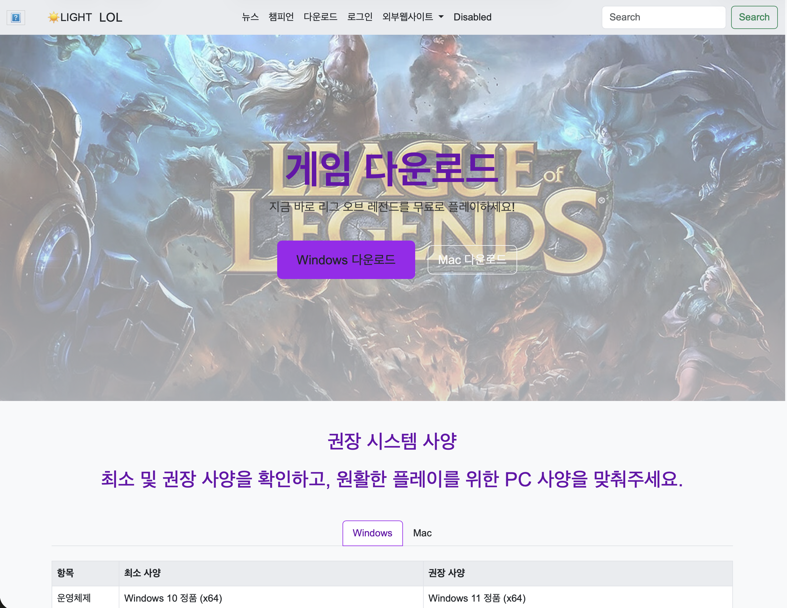
