# code-with-quarkus

## Running the application in dev mode

You can run your application in dev mode that enables live coding using:

```shell script
./mvnw quarkus:dev
```

> # quarkus 프로젝트 시작! (학번 :20230987 이름 : 노대영 )
>
> 매 주 수업 내용을 정리하자.

# 2주차 수업 내용

1. **Quarkus: 클라우드 네이티브 Java 프레임워크**

- Java 기반 백엔드 프레임워크, 빠른 시작 시간과 낮은 메모리 사용
- Quarkus+GraalVM: 13MB vs 기존 Traditional Stack 140MB
- 컨테이너 환경(Kubernetes) 실행 최적화, GraalVM 네이티브 컴파일 지원
- 장점: Spring Boot 대비 10배 빠른 부팅, AI 통합 쉬움
- 단점: 빌드 시간이 매우 길다

2. Quarkus 개발 환경 구축

- **VS Code + Quarkus Tools 확장 설치**
  - Extensions: Quarkus Tools, Extension Pack for Java, REST Client, Korean Language
  - Java JDK 21 버전 설치 필요 (VS Code에 내장 X)

- **Quarkus 프로젝트 생성 및 열기**
  - 공식 사이트에서 프로젝트 생성 (Group: org.acme, Java 21, Maven)
  - 선택 모듈: REST, Qute, Qute Web, OpenID Connect, WebSockets 등
  - VS Code에서 폴더 직접 열기 → 내부 구조 확인
    - `java/org/acme`: .java 파일 관리
    - `resources/META-INF/resources`: HTML 등 정적 자원
    - `pom.xml`: 모듈 설정

- **서버 실행 및 설정**
  - 실행: `./mvnw quarkus:dev` / 종료: `Ctrl+C` 또는 `q`
  - 기본 포트: `http://localhost:8080/`
  - `application.properties` 주요 설정:
    ```properties
    quarkus.http.port=8080
    quarkus.http.static-resources.index-page=index.html
    quarkus.test.continuous-testing=disabled
    ```
  - 개발 전용 UI: 터미널에서 `d` 입력 → `http://localhost:8080/q/dev-ui/extensions`

- **HTML 기본 태그**

  | 태그              | 역할                           |
  | ----------------- | ------------------------------ |
  | `<!DOCTYPE html>` | HTML5 문서 선언                |
  | `<html>`          | 최상위 컨테이너                |
  | `<head>`          | 메타데이터, 스타일 시트, 제목  |
  | `<meta>`          | 문자 인코딩, 뷰포트, SEO 정보  |
  | `<body>`          | 화면에 보이는 콘텐츠           |
  | `<div>`           | 레이아웃용 블록 박스           |
  | `<h1>~<h6>`       | 제목 (숫자 클수록 중요도 낮음) |
  | `<p>`             | 문단 (앞뒤 여백 자동 생성)     |
  | `<ul>`, `<li>`    | 순서 없는 목록                 |

3. lol 메인화면 구현

- **1단계**: 기본 골격 — `h1`, `p`, `ul`, `li`, `div`로 LOL 메인화면 뼈대 작성
- **2단계**: Bootstrap 5 레이아웃 및 네비바 — CDN 방식 연동, `nav`, `container`, `row/col`, 카드 컴포넌트
- **3단계**: 커스텀 CSS 스타일링 — LOL 다크 테마 (`#0a0e17` 배경, `#a020f0` 포인트 컬러)
- **4단계**: 인터랙티브 효과 — 마우스 호버 시 카드 확대(`scale(1.05)`), 보라색 광원 효과(`box-shadow`)

# 4주차 수업 내용 (HTML과 CSS 심화)

1. **Bootstrap 5 기본 활용**

- 태그 = HTML5 기본 태그 / 속성(class) = Bootstrap5 디자인
- Navbar 구조: `navbar-expand-lg`, `navbar-dark`, `container-fluid`, `ms-auto`
- Bootstrap5 해제(Ctrl+/)로 태그 역할 확인 가능

2. **하이퍼 링크와 이미지**

- `<a href="주소" target="_blank">` : 링크, `_blank`는 새 탭 열기
- `` : 이미지, 외부 URL 또는 로컬 경로 사용
- 상대 경로(`./`, `../`) vs 절대 경로(`http://`, `/`)

3. **CSS 선택자 우선순위**

| 선택자     | 예시                      | 우선순위 |
| ---------- | ------------------------- | -------- |
| 요소       | `div`, `p`, `img`         | 낮음     |
| 클래스     | `.card`, `.accent-purple` | 중간     |
| ID         | `#championGrid`           | 높음     |
| 결합       | `.card:hover`             | 중간+    |
| !important | `color: white !important` | 최고     |

4. **HTML/CSS 심화 실습**

- **네비게이션 바 수정**
  - Bootstrap5 공식 문서에서 드롭다운 메뉴 있는 네비바 복사 후 삽입
  - 메뉴명 한글로 수정, 드롭다운 메뉴와 외부 링크 추가

- **챔피언 카드 추가 (Bootstrap Grid)**
  - Bootstrap 반응형 그리드: `col-md-*`, `col-lg-*`, `col-xl-*`
  - `row-cols-auto`: 화면 크기에 따라 자동으로 열 수 조정
  - 카드 구조: `card-img-top` + `card-body` + `card-footer` + 버튼

- **카드 → 모달창 구현**
  - 버튼의 `data-bs-target="#modalID"` ↔ 모달의 `id="modalID"` 연결
  - 모달 body 안에 `<iframe>` 태그로 별도 HTML 파일 삽입
  - id vs class: id는 문서 내 고유 식별자, class는 여러 요소에 재사용

- **서브 페이지 추가**
  - `main_page_sub/`: download.html, champion.html, news.html 생성
  - `login/login.html`: 아이디, 패스워드 입력 폼
  - `modals/Aatrox.html`: iframe으로 모달에 삽입

- **CSS 파일 분리 (외부 CSS)**
  - `resources/css/` 폴더 생성 → 외부 CSS 파일로 분리
  - HTML에서 연결: `<link rel="stylesheet" href="../css/download.css">`
  - CSS Flexbox 활용: `display: flex`, `align-items: center`, `justify-content: center`

5. **HTML 테이블 태그**

| 태그                  | 역할                |
| --------------------- | ------------------- |
| `<table>`             | 표 전체             |
| `<thead>` / `<tbody>` | 헤더 / 본문 행 그룹 |
| `<tr>`                | 행(row)             |
| `<th>` / `<td>`       | 헤더 셀 / 데이터 셀 |

- F12 개발자 모드: Elements 탭에서 HTML/CSS 실시간 확인 및 수정 가능

# 4주차 과제

1. 로고추가, 로고 이름 변경
2. navBar에서 글자들을 가운데 정렬
3. 새로운 캐릭터들을 추가 후 아트록스와 같이 사진변경,상세설명 추가,모달 추가 후 배경 변경 하였다.
4. Bootstrap을 활용하여 수정하였다.


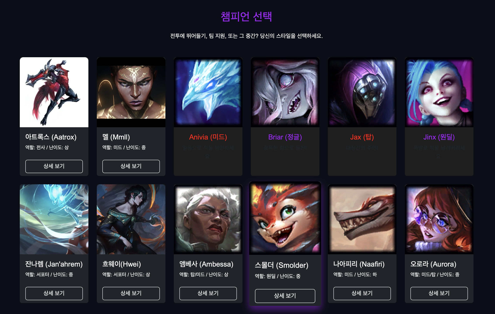


# 5주차 수업 내용

1. 서브 페이지 추가하기

- 4주차 이어서 내비게이션 바에서 다운로드 선택 시 다운로드 창을 만듦
- `main_page_sub/` 폴더 생성 → `download.html`, `champion.html`, `news.html` 파일 생성
- `login/login.html` 생성 → 아이디, 패스워드 입력 폼
- 네비게이션 바 링크 수정: `href="main_page_sub/download.html"`

2. 다운로드 페이지 구현 (download.html)

- 상단 배경 이미지(download-banner.jpg) 삽입, 클릭 시 다운로드 파일 링크 연결
- Windows / Mac 다운로드 버튼 구분
- CSS Flexbox 활용: `display: flex`, `align-items: center`, `justify-content: center`

3. 시스템 사양 테이블 추가

- 다운로드창에 권장 시스템 사양 표를 넣음
- HTML 테이블 태그 활용:

| 태그                  | 역할                |
| --------------------- | ------------------- |
| `<table>`             | 표 전체             |
| `<thead>` / `<tbody>` | 헤더 / 본문 행 그룹 |
| `<tr>`                | 행(row)             |
| `<th>` / `<td>`       | 헤더 셀 / 데이터 셀 |

- 반응형 표: 화면 크기 변경 시 Windows / Mac 탭 자동 전환

4. CSS 파일 분리 (외부 CSS)

- `resources/css/` 폴더 생성 → 기존 `<style>` 내 코드를 `download.css` 파일로 분리
- HTML에서 연결: `<link rel="stylesheet" href="../css/download.css">`
- 기존 `<style>` 태그는 삭제


# 6주차 수업 내용

1. 자바스크립트 개요

- HTML = 구조(Structure), CSS = 스타일(Style), **JS = 동작(Behavior)**
- 예) 버튼을 누르면 불이 켜진다 → JS 담당
- JS 전용 엔진: 웹 브라우저 내장 (대표: 구글 크롬 V8 엔진)
- 인터프리터 언어 → 바로 번역 및 실행 (컴파일 언어와 다름)

2. JS 연동 방식 3가지

| 구현 방식                       | 설명                                     | 권장 여부                 |
| ------------------------------- | ---------------------------------------- | ------------------------- |
| 인라인 (Inline JS)              | HTML 태그 안에 직접 작성 `onclick="..."` | ❌ 보안 이슈(XSS), 비권장 |
| 내부 스크립트 (Internal JS)     | `<script>` 태그로 HTML 내부에 작성       | ❌ 구조 분리 부족         |
| **외부 스크립트 (External JS)** | `<script src="app.js">` 로 파일 분리     | ✅ **가장 권장되는 방식** |

- 인라인 함수: 가장 보안에 취약한 방식, 웹사이트에서 차단 가능 (XSS 공격 위험)
- 내부 스크립트 예시 (window.onload: 페이지에 누르면 바로 실행됨)

```js
// (자바스크립트에서 실행되면 해킹의 위험성이 큼)
window.onload = function () {
  alert("메인 페이지 로딩 완료");
};
```

3. **var / let / const 스코프 차이**

- `var`는 함수 스코프 → `if` 블록 밖에서도 접근 가능
- `let` / `const`는 블록 스코프 → `{}` 밖에서 접근 시 ReferenceError 발생
- `var`는 재선언·재할당 모두 가능 / `let`은 재할당만 가능 / `const`는 둘 다 불가

```js
// 스코프 차이
if (true) {
  var a = "var 변수";   // 블록 밖에서 접근 가능
  let b = "let 변수";   // 블록 밖 접근 시 ReferenceError
}

// 재선언 & 재할당
var x = 10;
var x = 20; // 가능
let y = 30;
y = 40;     // 재할당 가능 (재선언 불가)
const z = 50; // 재할당 불가
```

4. **호이스팅(Hoisting)**

- `var`는 선언 전 접근 시 `undefined` 출력 (선언만 끌어올림)
- `let` / `const`는 TDZ(Temporal Dead Zone) 발생 → 선언 전 접근 시 ReferenceError
- TDZ가 발생하면 그 이후 코드도 실행 중단됨

5. **성능 측정 실습 (test2.js)**

- 1,000,000개 데이터로 일반 배열 vs 객체 배열 탐색·가공 성능 비교
- `console.time()` / `console.timeEnd()` 활용한 성능 측정
- `indexOf` vs `find()` / `map()` 비교

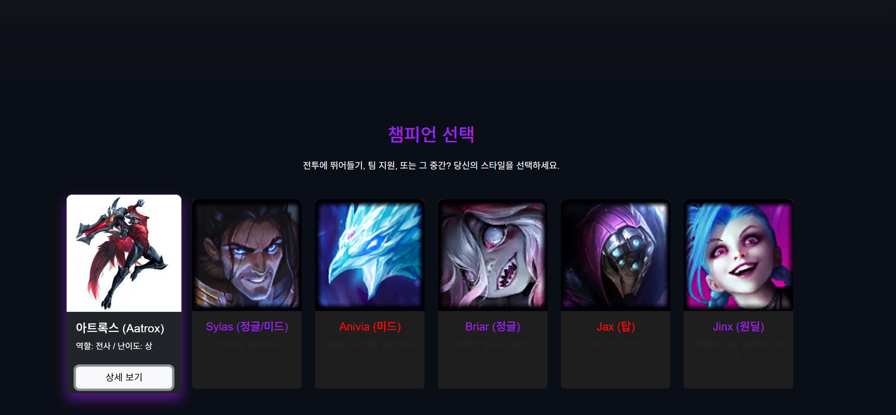

# 7주차 수업 내용

1. 서치 폼을 만들어 캐릭터 검색을 하면 웹페이지에 들어가 있는 캐릭터 정보가 뜨게끔 만듦.
2. main.css 파일을 css 폴더에 넣은 후 index 파일에서 연결링크를 넣은 후 main.css 파일에서 아트록스를 관리할 수 있게 해줌.
3. 검색에서 없는 검색어는 그 검색어에 맞춰 출력 후 각 뉴스/캐릭터에 없다는 글을 뜨도록 설정하고, 이벤트를 넣어 챔피언이 있는지 없는지 관리할 수 있도록 하였다.


# 7주차 과제

1. search.js CHAMPIONS 배열에 신규 챔피언 데이터 7개 추가

- 앰베사(Ambessa) / 스몰더(Smolder) / 나아피리(Naafiri) / 오로라(Aurora) 등 모든 캐릭터
- 검색창에 이름 입력 시 정상 검색 및 카드 출력
- 카드 클릭 시 모달창으로 상세 정보 표시 (search.js `openChampionModal` → iframe 동적 생성 방식으로 수정)

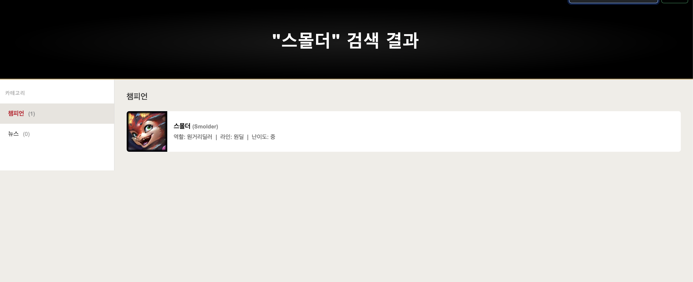
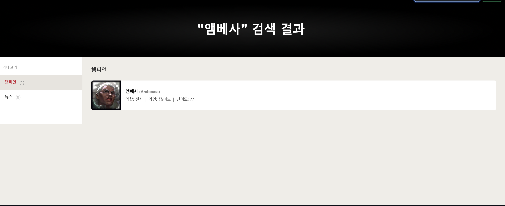


2. showMainScreen() 함수 구현 — 검색어가 없거나 공백일 경우 메인화면으로 복귀

- performSearch()에서 검색어(q)가 없으면 showMainScreen() 호출
- 메인화면 복귀 시 기존 section이 다시 보이도록 d-none 제거 및 searchResults 숨김

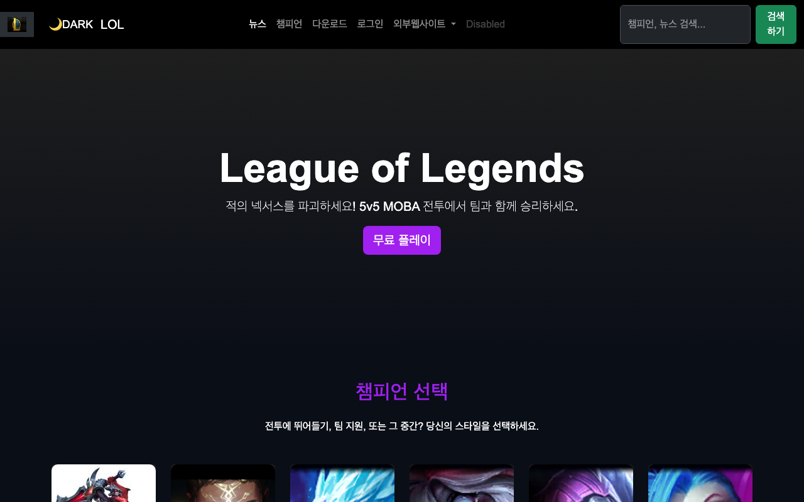

3. 추가한 캐릭처 전체 modal창 구현


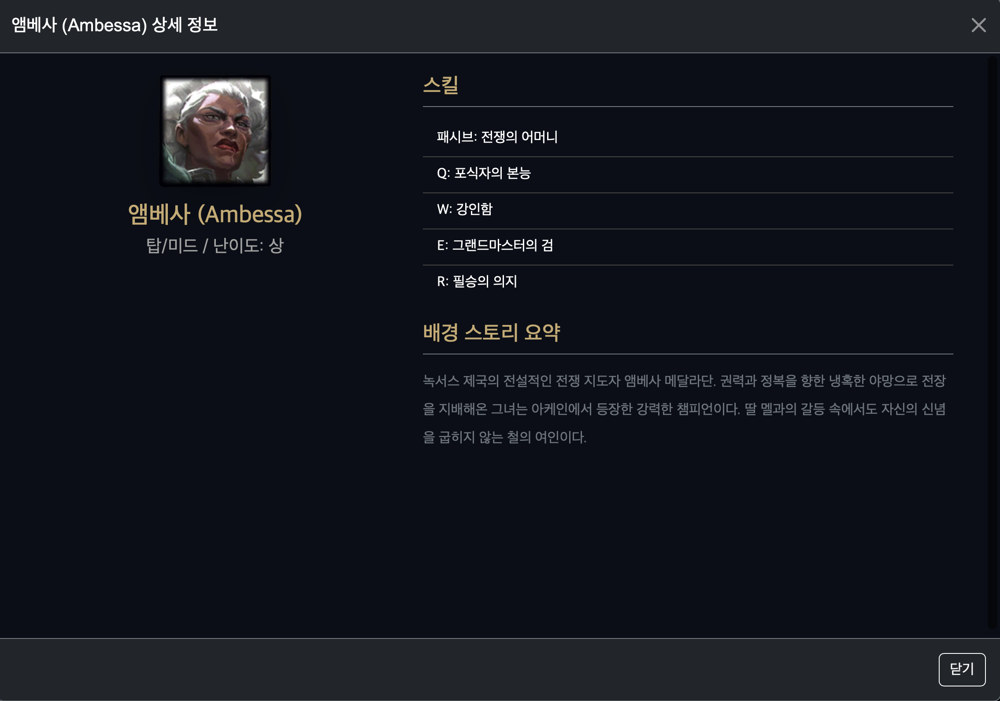
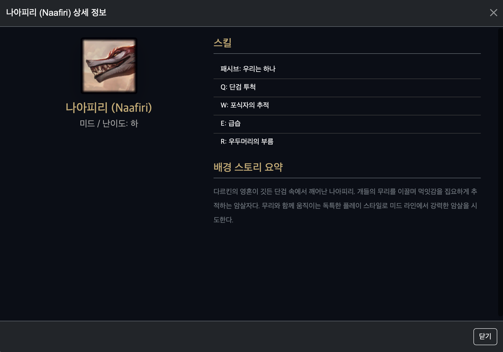

<video controls src="20260415-0954-57.4169456.mp4" title="Title"></video>

# 9주차 수업 내용 (JS 기능 추가 및 MySQL 연동)

## PART 1 : 트렌드 / 이론 (자바스크립트 엔진)

1. 구글 JS 엔진(V8)

- 단순 인터프리터 → 다단계 컴파일러(AJIT) 구조
- Ignition(인터프리터) → Bytecode → TurboFan(JIT 컴파일러) → 최적화된 네이티브 코드
- C++ 기준 50~80% 성능, 웹 브라우저 기반 3D 게임 실행 가능

2. WebAssembly (WASM 3.0+)

- 고성능 웹 앱 처리 (비디오 코덱, 물리 연산, 게임 로직, AI 추론)
- 기계어 수준, Liftoff(1단계 컴파일러)로 빠른 시작
- 예) 유니티 웹 게임 개발 (WASM, C# NATIVE 언어 지원)

## PART 2 : LOL 기능 - 다크/라이트 모드 전환

1. 자바스크립트 자료 구조

- 객체 배열(Array of Objects) vs 일반 배열(Basic Array)
- 객체 배열: `[{key:value}]` → news[0].title (이름으로 접근, 의미 명확)
- 일반 배열: `[value, value]` → news[0] (순서로 접근, 빠름)

2. 다크/라이트 모드 토글 구현

- 네비게이션바 토글을 연결해 글자를 선택하면 다크/화이트 모드로 변경되도록 설정
- HTML: 로고 옆에 토글 버튼 추가 (`onclick="toggleTheme()"`)
- CSS(main.css): `body.light-mode` 라이트 모드 스타일 추가 (important로 강제)
- JS(toggle.js): `classList.toggle('light-mode')` 로 한 줄로 토글 처리

```js
function toggleTheme() {
  const body = document.body;
  body.classList.toggle("light-mode");
  // 클래스 유무에 따라 navbar 클래스, 버튼 텍스트(DARK/LIGHT) 변경
}
```

## PART 3 : 데이터베이스 연동 (MySQL)

1. 자바 소스코드 살펴보기

- java/org/acme 폴더 (GreetingResource.java 등) → `@Path`, `@GET` 어노테이션으로 경로/메서드 정의
- Quarkus는 내부 main()을 빌드 타임에 자동 생성 (CDI 컨테이너 ArC가 Bean 생성·관리·연결)

2. MySQL 데이터베이스 8.x 설치

- Community 버전(오픈소스), Server only 설치, 패스워드 설정(123123)
- DB의 연결과 현재 내가 만든 코드들의 파일 상태 확인 가능
- mysql은 데이터를 주고받기 위해서 3306 포트로 설정
- 접속 후 `show databases;` / `create database lol;` / `use lol;`

3. 프로젝트 의존성 추가 (pom.xml)

| 라이브러리                    | 역할                               |
| ----------------------------- | ---------------------------------- |
| quarkus-jdbc-mysql            | Java ↔ MySQL 연결 드라이버         |
| quarkus-hibernate-orm-panache | 테이블 자동 생성, SQL 없이 DB 조작 |
| quarkus-rest-jackson          | 객체를 JSON으로 변환하여 응답      |

4. application.properties DB 설정

```properties
quarkus.datasource.db-kind=mysql
quarkus.datasource.username=root
quarkus.datasource.password=123123
quarkus.datasource.jdbc.url=jdbc:mysql://localhost:3306/lol
quarkus.hibernate-orm.database.generation=update
```

5. 테이블 생성 및 데이터 (ORM)

- Champion.java: `@Entity` + `extends PanacheEntity` → 테이블 자동 매핑
- ChampionResource.java: `@GET` 목록 조회, `@POST` 데이터 저장 (JSON)
- DataSeeder.java: 서버 시작 시 챔피언 데이터 자동 삽입 (`@Observes StartupEvent`)
- `http://localhost:8080/champions` → JSON 응답 확인
- DB는 dev 보드(`http://localhost:8080/q/dev/`)에서 확인 가능

# 9주차 과제

사진과 같이 검색 하였을 때 캐릭터가 나오고 상세버튼을 눌렀을 때 모달창이 나오게 하였다.
(검색 결과 카드에 modalId 속성 추가 → Bootstrap 모달 열기)


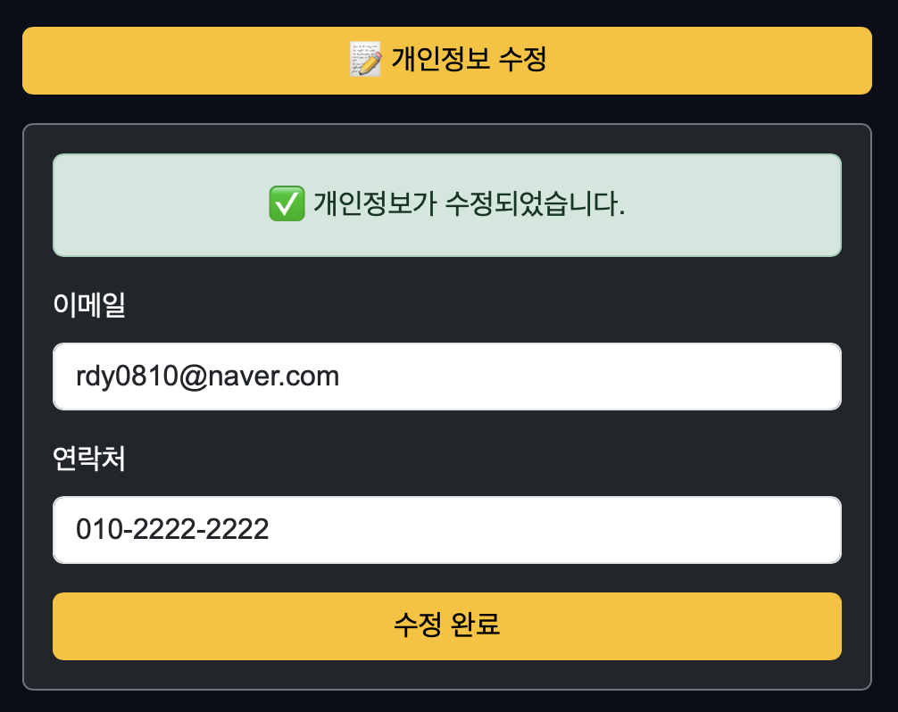
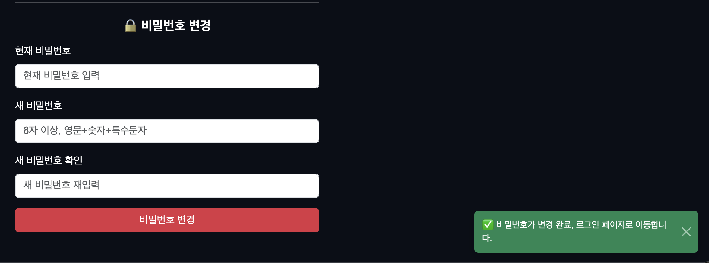

# 10주차 수업 내용 (로그인과 로그아웃)

## PART 1 : 웹 보안 이론

- 웹 보안: 쿠키(웹브라우저에 저장) ex: 장바구니
- 개인정보는 백엔드 자체 DB에 저장 후 꺼내올 수 있도록 해야 함 (다운로드 서버 창과 다름)
- 최근 보안 사고: 유튜브 채널 세션 탈취, npm 공급망 공격(세션 쿠키/계정 탈취)
- 인증 방식: 세션 쿠키 방식 사용 (Quarkus 내장)

| 구분      | 세션 방식       | 토큰 방식(JWT)       |
| --------- | --------------- | -------------------- |
| 저장 위치 | 서버 메모리     | 클라이언트(브라우저) |
| 확장성    | 낮음(서버 부담) | 높음(stateless)      |
| 보안      | 서버가 관리     | 탈취 시 위험         |

- 도메인 패키지 구조: 계층형보다 도메인형(champion/, login/, common/)이 응집도 높고 충돌 최소화

## PART 2 : 로그인 / 로그아웃 구현

1. 로그인 페이지 작성

- 메인화면 네비바 로그인 링크 수정: `<a href="/login">로그인</a>`
- 로그인 창을 만들고 네비게이션바를 그대로 갖고 와서 로그인 파일(login 폴더)에 넣는다.
- login 폴더에 AuthResource.java 작성 (`@Path("/")`, GET /login → login.html 반환)
- AuthResource.java에 login.html에서 값을 받으면 파라미터가 되도록 값을 다시 받는 코드를 넣는다.
- login.html: 아이디/패스워드 입력 폼 (`method="POST" action="/login_check"`)

2. 사용자 테이블 & DB 인증

- User.java 작성: `@Entity @Table(name="users")` (예약어 충돌 방지: user → users)
- `extends PanacheEntity` 라이브러리에서 만들어진 함수(listAll, findById 등)를 갖다 쓸 수 있다.
- DataSeeder.java에 guest 계정 추가 (guest / 123123)
- /login_check 엔드포인트: `@FormParam`으로 값 받아 DB 조회 후 인증
- 세션에 로그인 정보 저장: `context.session().put("loginUser", username)`
- SessionConfig.java: 세션 활성화 (Router 등록, HttpOnly 플래그, 1시간 타임아웃) → 실시간으로 사람이 쓰고 있는지 검사

3. 로그인 후 / 로그아웃

- main_after_login.html: 기존 index 재활용, 로그아웃 버튼 추가
- /after_login: 세션 체크 → 세션 없으면 /login으로 강제 이동 (Forced Browsing 방지)
- /logout: `session().destroy()` 로 세션 전체 삭제 후 메인 이동

전 주 내용을 이어서 로그인을 할 때 DB에서 연동이 되고, 실제 사람이 로그인을 할 때 아이디 중복 등 체크하여 로그인이 가능한지 판단하는 것을 나감. DB와 프론트, 백엔드의 관계를 배우면서 계층을 나눠 오류 발생 시 해결하기 편하도록 나눴음.

## 10주차 요약 (중요 개념)

- 세션 방식: 로그인 정보를 서버 메모리에 저장, 클라이언트는 세션 ID(쿠키)만 보유
- JWT 방식: 토큰을 클라이언트(브라우저)에 저장, 확장성 높지만 탈취 시 위험
- 도메인 패키지 구조: 계층형보다 도메인형이 응집도 높고 충돌 최소화
- HTTP 상태코드: 200(성공), 302(리다이렉트/POST유지), 303(리다이렉트/GET전환), 404(없음)


# 10주차 과제

1. download.css에 다크/화이트 모드 코드를 추가하여 로그인창과 같이 만들었음 (구버전 네비바는 다크/라이트 모드 작동 X → 기존 index.html 네비바/CSS 재활용)
2. ../로 상대경로를 올바르게 보완했음

```css
/* 테마 토글 버튼 */
#themeToggleBtn {
  font-size: 1.1rem;
  color: #fff;
}
/* 라이트 모드 */
body.light-mode {
  background-color: #f8f9fa;
  color: #212529;
}
body.light-mode .navbar {
  background-color: #e9ecef !important;
}
body.light-mode .hero {
  background:
    linear-gradient(rgba(255, 255, 255, 0.45), rgba(220, 227, 234, 0.75)),
    url("../image3/lol download.png") center/cover no-repeat;
}
body.light-mode .table {
  --bs-table-bg: #fff;
  --bs-table-color: #212529;
}
body.light-mode .accent-purple {
  color: #6a0dad;
}
```


# 12주차 수업 내용 - 회원가입, 암호화

## PART 1 : 암호화 이론

- 2024년 인터파크 DB 해킹: 1,030만 명 개인정보 유출 (패스워드 평문 저장이 원인)
- 해시 함수에 대해 배움 (단방향 암호화: 암호화만 가능, 복호화 불가)

| 알고리즘 | 보안 수준            | 실습 |
| -------- | -------------------- | ---- |
| MD5      | ❌ 취약              | X    |
| SHA-1    | ❌ 취약              | X    |
| SHA-256  | ✅ 적합              | ✅   |
| bcrypt   | ✅✅ 강력(salt 포함) | 실무 |

- 회원가입/로그인 요청이 POST가 되면 이용자의 개인정보를 위해 password는 DB에서 암호화되어 실제 암호가 보이지 않도록 됨 (SHA-256 활용)
- 해시값 유출 → 복구 불가능

## PART 2 : 회원가입 구현

1. 회원가입 페이지 추가

- login.html에 회원가입 버튼 추가 (`<a href="/register">`)
- AuthResource.java에 /register 엔드포인트 등록 (register.html 반환)
- register.html: 아이디/패스워드/패스워드확인/이메일/연락처 폼 (기존 login 디자인 재활용)

2. 회원 테이블 수정 (User.java)

- email, phone 컬럼 추가, `@Column(unique=true)` 이메일 중복 방지
- findByUsername, findByEmail 정적 메서드 추가

3. 입력값 유효성 검사 (input_check.js - 정규식)

| 검사 항목 | 정규식                                            |
| --------- | ------------------------------------------------- |
| 아이디    | `/^[a-zA-Z0-9]{4,20}$/`                           |
| 패스워드  | `/^(?=.*[a-zA-Z])(?=.*\d)(?=.*[!@#$%^&*]).{8,}$/` |
| 이메일    | `/^[^\s@]+@[^\s@]+\.[^\s@]+$/`                    |
| 연락처    | `/^010-\d{4}-\d{4}$/`                             |

- input_check.js(유효성 검사), input_sha256.js(Crypt API 동작 흐름)를 만들어 구현

4. SHA-256 해시 암호화 (input_sha256.js)

- 브라우저 내장 Web Crypto API 사용 (`crypto.subtle.digest('SHA-256', data)`)
- 패스워드를 해시화 후 hidden 필드에 저장 → 서버에는 평문이 아닌 해시값 전송
- async/await 필요 (해시 계산은 비동기 처리)

```js
async function hashPassword(password) {
  const encoder = new TextEncoder();
  const data = encoder.encode(password);
  const hashBuffer = await crypto.subtle.digest("SHA-256", data);
  const hashArray = Array.from(new Uint8Array(hashBuffer));
  return hashArray.map((b) => b.toString(16).padStart(2, "0")).join("");
}
```

5. /register_check 엔드포인트 (AuthResource.java)

- 아이디 중복 체크 → 이메일 중복 체크 → DB 삽입 → /register_success 이동
- 전체 흐름: 로그인창에서 회원가입을 하여 로그인이 되기까지
- DB에는 해시값만 저장 → 해킹되어도 패스워드 복구 불가

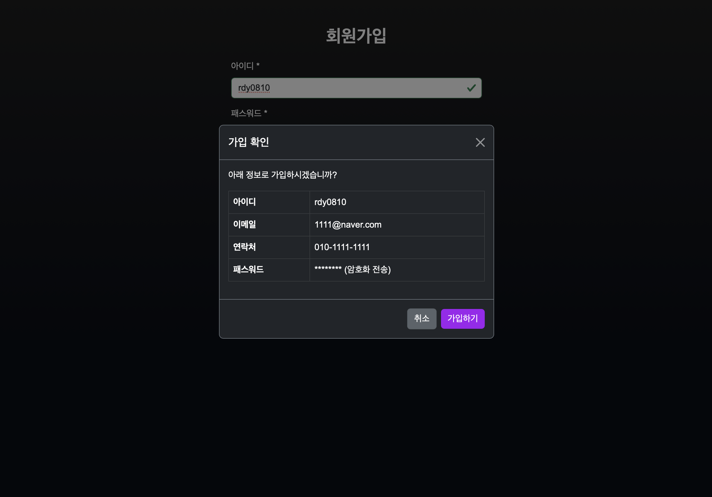
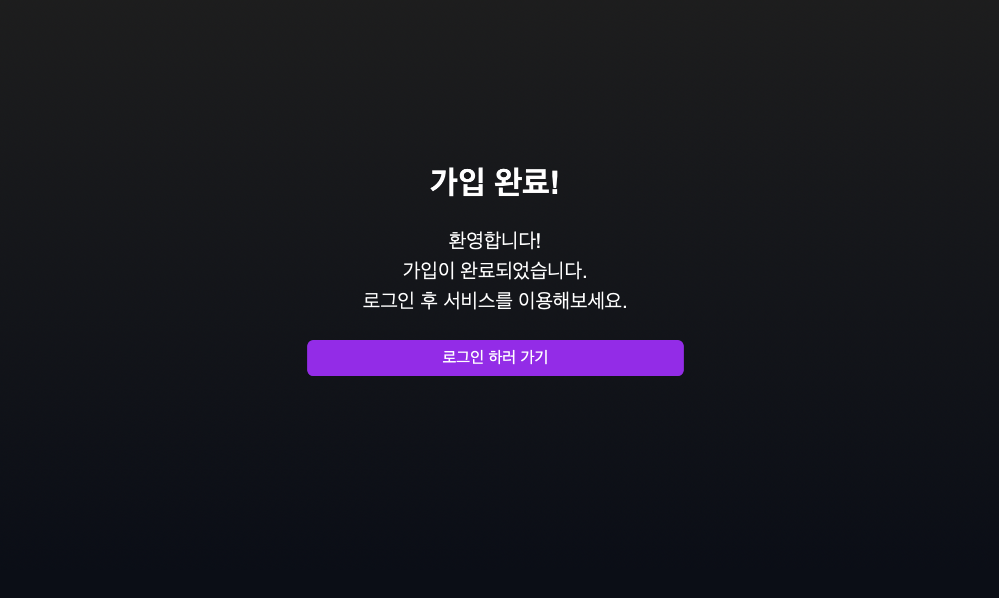

# 12주차 과제 - 회원가입, 암호화

로그인 화면(login.html)의 입력값 체크를 회원가입 register.html과 동일하게 JS 정규식으로 구현

1. 아이디 유효성 검사 (4~20자 영문/숫자)
   정규식: `/^[a-zA-Z0-9]{4,20}$/`
2. 패스워드 유효성 검사 (8자 이상, 영문+숫자+특수문자)
   정규식: `/^(?=.*[a-zA-Z])(?=.*\d)(?=.*[!@#$%^&*]).{8,}$/`
3. 두 항목 모두 통과 시 로그인 실행

요약:

```
로그인 버튼 클릭 → validateAndLogin() 실행
 ① 아이디 검사: 실패 → 빨간 테두리 + 오류 메시지 / 성공 → 초록 테두리
 ② 패스워드 검사: 실패 → 빨간 테두리 + 오류 메시지 / 성공 → 초록 테두리
 ③ 둘 다 통과 → submitLogin() → SHA-256 해시 후 서버 전송
```

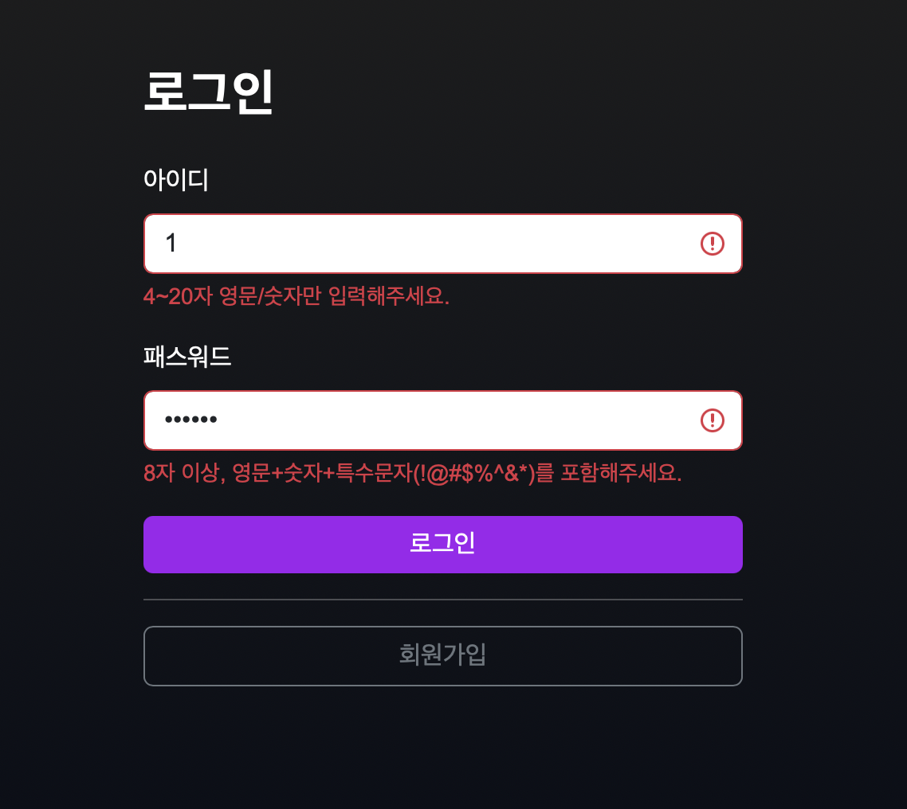

# 12주차 수업 내용 - 회원관리 페이지 1 (로그인 암호화 체크 / 프로필)

## PART 1 : 트렌드 - 콘텐츠 유형 분석

- HTTP Archive Web Almanac 2024/2025 통계: 용량은 이미지 54.8%, 자바스크립트 34%
- 이미지 형식은 WebP, AVIF가 좋다 (고해상도 저용량)
- 실제 서비스 파일 저장: 카카오톡/네이버/당근마켓 등은 CDN 또는 AWS S3에 분리 저장 (이름과 파일 분리)
- 오늘 수업: 서버 로컬에 이미지 저장, DB에는 파일명 저장

## PART 2 : 로그인 - 암호화 체크

1. 로그인 페이지 암호화 구현 (login.html)

- 전 시간에 하였던 암호화 로그인 후 데이터베이스에 저장되어 메인 홈 화면 페이지로 전달되게 함
- 아이디/패스워드 필드에 id 추가 (usernameInput, passwordInput), hidden(id="password")
- 버튼 클릭 → validateAndLogin() → submitLogin() → SHA-256 해시 → hidden 저장 → submit
- login.js: 정규식 검사 + 해시 후 전송 (평문이 아닌 해시값만 전송)

2. guest 계정 패스워드 - 해시값으로 교체

- 기존 평문 패스워드 123123은 로그인 안 됨 (로그인 수정 이후 해시값을 비교하기 때문)
- 암호화가 될 때 비번이 똑같으면 DB에서 똑같은 해시값이 주어지므로 정규식 조건을 만들어 패스워드 생성
- 정상적인 해시값은 다 소문자이다 (직접 바꾸거나 user table을 날리고 다시 만들어야 함)
- mysql 직접 접속: `UPDATE users SET password = LOWER(password) WHERE username = 'guest';`

## PART 3 : 메인화면 세션 체크

- 로그인 후에도 로그아웃 버튼이 안 보이는 문제 → 세션 체크 필요
- Index.html → main_index.html 이름 변경 (이유: `@Path("/")` 최상위 경로를 써서 로그인 유무를 먼저 판단하게 하기 위함. Quarkus가 index.html을 가장 먼저 정적 인식하므로)
- AuthResource.java `@GET @Path("/")`: 세션 유무에 따라 페이지 분기
  - 세션 있음(로그인) → main_after_login.html / 세션 없음 → main_index.html

## PART 4 : 프로필 페이지

1. 네비바에 프로필 링크 추가 (main_after_login.html 로그아웃 코드 상단에 프로필 추가)

- 이모지(Emoji)는 아이콘이 아니라 텍스트 (유니코드 문자)

2. 프로필 사진 컬럼 추가 (User.java)

- `public String profileImage;` (저장된 파일명, UUID 기반)

3. AuthResource.java에 profile 관련 엔드포인트 추가

- /profile: 세션 체크 → DB 조회 → profile.html 반환
- /profile/info: 세션 체크 후 JSON 응답 (Profile.js가 fetch로 사용자 정보를 비동기 수신 → 화면 갱신)
- /profile/upload: 확장자/크기(5MB) 검사 → UUID 파일명 생성 → upload/profile에 이미지 저장 → DB 업데이트

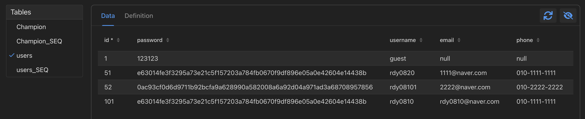

# 12주차 과제 - 회원관리 페이지 1

1. **로그인 에러 처리** — login.js 수정

```
사용자가 틀린 아이디/패스워드로 로그인 시도
→ 서버(AuthResource.java)에서 DB 불일치 확인
→ Response.seeOther("/login?error=1") 리다이렉트
→ 브라우저가 /login?error=1 로 이동
→ window.addEventListener('load') 실행
→ URLSearchParams로 error 값 추출
→ error === '1' → showError() 호출
→ 패스워드 필드 빨간 테두리 + "아이디 또는 패스워드가 올바르지 않습니다." 표시
```

2. **업로드 에러 처리** — profile.html, Profile.js 수정

```
사용자가 잘못된 파일 업로드 시도
→ 서버에서 검사 (확장자 불일치 → invalid_type / 5MB 초과 → too_large / 저장 실패 → upload_fail)
→ /profile?error=xxx 로 이동
→ Profile.js의 URLSearchParams로 error 값 추출
→ uploadErrorMsg div의 d-none 클래스 제거 (숨김 해제)
→ 빨간 박스에 메시지 표시
```

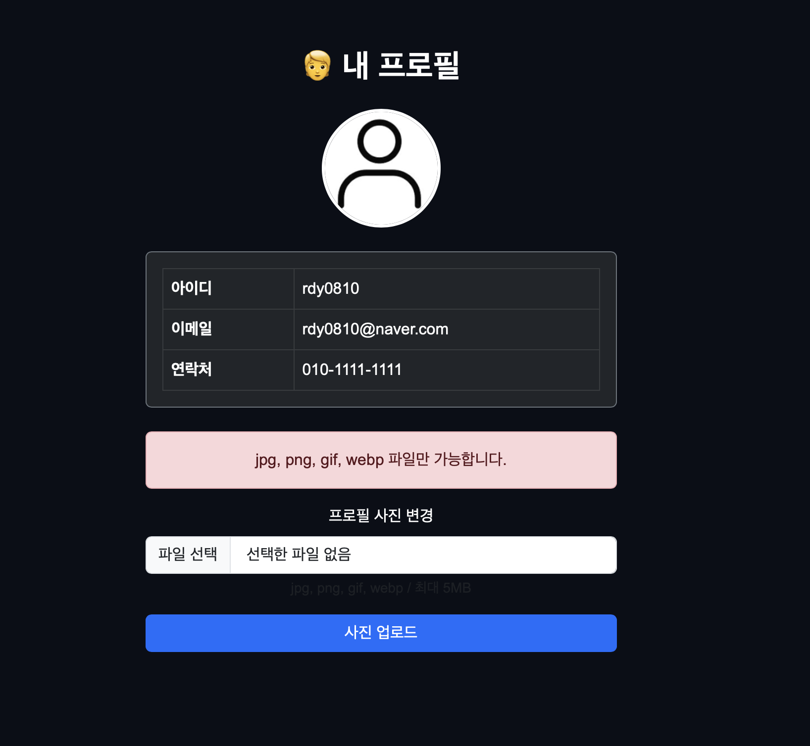

# 13주차 수업 내용 - 회원관리 페이지 2 (Toast, 회원정보 수정, 비밀번호 변경)

## PART 1 : 트렌드 - 2025 개인정보 유출

- 2025 개인정보 유출 현황: 쿠팡(3,370만 건), SK텔레콤 등 전국민 정보 유출
- 유출 경로: 내부(내부자), 외부(해킹) / 주요 원인: 피싱 메일, 악성코드
- 중요 개인정보의 불법유통 확대 (단돈 3천 원에 거래)

| 구분 | 설명 |
| ---- | ---- |
| 일반적 정보 | 주민등록번호, 이름, 주소, 전화번호 |
| 통신 위치 정보 | 통화, IP주소, GPS 등 |
| 사회적 정보 | 교육 정보, 근로 정보, 자격 정보 |
| 정신적 정보 | 기호, 성향, 신념, 사상 |
| 신체적 정보 | 신체정보, 의료, 건강정보 |
| 재산적 정보 | 개인, 신용정보, 부동산, 주식 |

- 최근 AI 모델 데이터 수집/생성 (AI 챗봇, 딥페이크, 보이스피싱) → 외부 전송 X, 로컬 최적화 대안
- 프라이버시 보호 대안: 외부 전송 X, 로컬에서 부분적 최적화 등

## PART 2 : 프론트 수정 (Toast 알림)

1. 브라우저 기본 알림(alert) → Bootstrap5 Toast로 교체

- alert()은 화면을 완전히 차단하고 버튼 클릭이 필수이므로 실제 서비스에서는 미사용
- Bootstrap5 Toast는 화면 차단 없이 자동으로 사라지는 비방해형 알림 (실제 서비스 표준)

| 구분        | alert()        | Toast        |
| ----------- | -------------- | ------------ |
| 화면 차단   | ✅ 완전 차단   | ❌ 차단 없음 |
| 사용자 조작 | 버튼 클릭 필수 | 자동 사라짐  |
| 실제 서비스 | ❌ 거의 미사용 | ✅ 표준      |

2. test.js 수정 → showToast() 함수 제공

```js
function showToast(message, type = "success") {
  const toastEl = document.getElementById("liveToast");
  const toastBody = document.getElementById("toastBody");
  if (!toastEl || !toastBody) return;
  toastEl.className = `toast align-items-center text-white bg-${type} border-0`;
  toastBody.textContent = message;
  const toast = new bootstrap.Toast(toastEl, { delay: 3000 });
  toast.show();
}
```

- 모든 페이지의 `alert()` 제거 → `showToast()` 로 교체

| 파일 | window.onload | onclick |
| ---- | ------------- | ------- |
| `main_index.html` | showToast('메인 페이지 로딩 완료') | showToast('즐거운 플레이 되세요') |
| `login/main_after_login.html` | showToast('로그인 성공!') | showToast('즐거운 플레이 되세요') |
| `login/login.html` | alert 제거 | - |
| `login/register.html` | alert 제거 (toast 없음) | - |
| `login/register_success.html` | showToast('회원가입이 완료되었습니다!') | - |

## PART 3 : 네비바 사용자명 동적 표시 (Tooltip)

- main_after_login.html 프로필 버튼: `fetch('/profile/info')` 로 사용자명 받아 Tooltip 표시
- Profile.js: `/profile/info` 엔드포인트 사용, 수정 폼 기존 값 자동 채우기

| 코드                       | 역할                                        |
| -------------------------- | ------------------------------------------- |
| data-bs-toggle="tooltip"   | Bootstrap에게 tooltip임을 선언              |
| data-bs-placement="bottom" | 말풍선 방향 (top/bottom/left/right)         |
| new bootstrap.Tooltip(el)  | JS로 tooltip 초기화 (동적 title이므로 필수) |

## PART 4 : 회원정보 수정

- profile.html에 Bootstrap Collapse(접기/펼치기) 기반 회원정보 수정 폼 추가
- 이메일·연락처 정규식 검사 후 `/profile/update` POST 전송
- 수정 성공: `/profile?success=updated` → 성공 메시지 표시
- 이메일 중복: `/profile?error=duplicate_email` → 오류 메시지 표시

```
수정 완료 클릭 → validateAndUpdate() 실행
 ① 이메일 정규식 검사
 ② 연락처 정규식 검사 (010-XXXX-XXXX)
 ③ 모두 통과 → /profile/update POST 전송 → DB 업데이트
```

## PART 5 : 비밀번호 변경

- profile.html에 비밀번호 변경 폼 추가 (현재PW / 새PW / 새PW 확인)
- 현재·새 비밀번호 SHA-256 해시 후 `/profile/password` POST 전송
- 변경 성공: Toast 알림 → 3.5초 후 `/logout?next=login` → 로그인 페이지로 이동
- 현재 PW 불일치: `/profile?error=wrong_password` → 오류 Toast + 메시지 표시

```
비밀번호 변경 클릭 → validateAndChangePassword() 실행
 ① 현재 비밀번호 빈 값 체크
 ② 새 비밀번호 정규식 검사 (8자+영문+숫자+특수문자)
 ③ 새 비밀번호 확인 일치 여부
 ④ SHA-256 해시 생성 → hidden 필드 저장 → 서버 전송
```

## setTimeout 비동기 처리 이론

- `setTimeout(함수, 대기ms)`: 지정 시간(ms) 이후 함수 실행 (Web API → Event Loop → Task Queue)
- 비동기 처리: 대기 중에도 다른 코드 실행 가능 (블로킹 없음)
- 1000ms = 1초 / 3500ms = 3.5초 대기 후 실행
- 취소 방법: `clearTimeout(id)`

```js
// 비밀번호 변경 성공 → Toast → 3.5초 후 로그인 페이지 이동
if (success === 'password_changed') {
    showToast('✅ 비밀번호가 변경 완료, 로그인 페이지로 이동합니다.', 'success');
    setTimeout(function() {
        window.location.href = '/logout?next=login';
    }, 3500);
}
```

## AuthResource.java 추가 엔드포인트

| 엔드포인트          | 메서드 | 역할                             |
| ------------------- | ------ | -------------------------------- |
| `/profile/info`     | GET    | 프로필 JSON 반환                 |
| `/profile/update`   | POST   | 이메일·연락처 수정               |
| `/profile/password` | POST   | 비밀번호 변경 (해시값 비교)      |
| `/logout`           | GET    | 세션 삭제 (`?next=login` 지원)   |

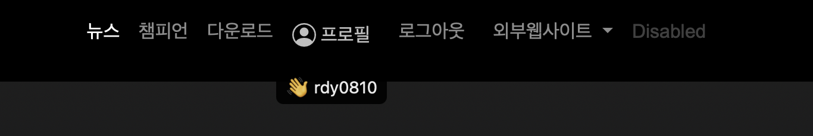
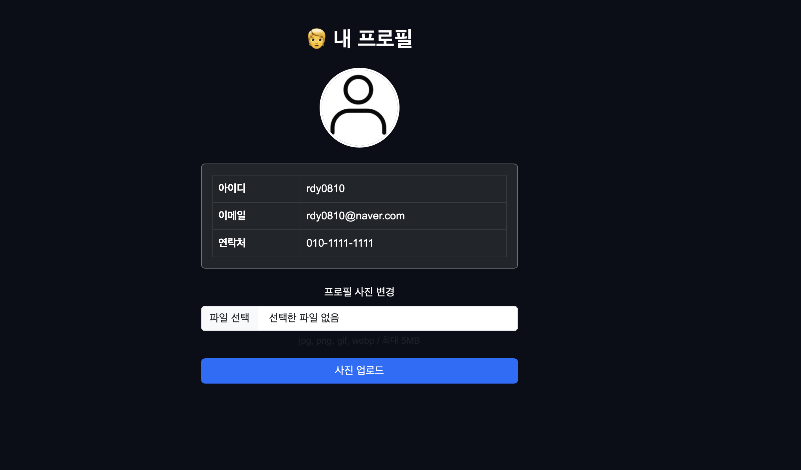

# 13주차 과제 - 회원관리 페이지 2

1. **alert → Toast 교체** (test.js showToast 함수 활용)

| 파일 | window.onload 처리 | onclick 처리 |
| ---- | ------------------ | ------------ |
| `main_index.html` | showToast('메인 페이지 로딩 완료') | showToast('즐거운 플레이 되세요') |
| `login/main_after_login.html` | showToast('로그인 성공!') | showToast('즐거운 플레이 되세요') |
| `login/login.html` | alert 삭제 | - |
| `login/register.html` | alert 삭제 (toast 없음) | - |
| `login/register_success.html` | showToast('회원가입이 완료되었습니다!') | - |

- `test.js` 수정: 기존 JS 실습 코드 → showToast(message, type) 함수로 교체
- 각 페이지 `</body>` 위에 Toast 컨테이너 HTML 추가
- Toast type: `'success'`(초록) / `'danger'`(빨강) / `'warning'`(노랑)

2. **회원정보 수정 구현**

- `profile.html`: Bootstrap Collapse 기반 수정 폼 추가 (이메일, 연락처 입력)
- `Profile.js`: `validateAndUpdate()` 함수 추가 (정규식 검사 후 제출)
- `AuthResource.java`: `/profile/update` POST 엔드포인트 추가

```
수정 완료 클릭 → validateAndUpdate() 실행
 ① 이메일 형식 검사 (/^[^\s@]+@[^\s@]+\.[^\s@]+$/)
 ② 연락처 형식 검사 (/^010-\d{4}-\d{4}$/)
 ③ 통과 시 /profile/update POST → DB 업데이트 → /profile?success=updated
```

3. **비밀번호 변경 구현**

- `profile.html`: 비밀번호 변경 폼 추가 (현재PW / 새PW / 새PW 확인, hidden 필드)
- `Profile.js`: `validateAndChangePassword()` async 함수 추가 (SHA-256 해시 후 전송)
- `AuthResource.java`: `/profile/password` POST 엔드포인트 추가
- `/logout` 엔드포인트 수정: `?next=login` 파라미터 지원 → 비밀번호 변경 후 로그인 페이지로 이동

```
비밀번호 변경 클릭 → validateAndChangePassword() 실행
 ① 현재 비밀번호 빈 값 체크
 ② 새 비밀번호 정규식 검사 (8자+영문+숫자+특수문자)
 ③ 새 비밀번호 확인 일치 여부 체크
 ④ SHA-256 해시 생성 → hidden 필드 저장 → /profile/password POST 전송
 ⑤ 성공 시 Toast 알림 → 3.5초 후 /logout?next=login → 로그인 페이지 이동
```

4. **마무리 Final Check**

- 네비바 Disabled 항목 제거 (`main_index.html`, `main_after_login.html`)
- 로그인 성공 Toast 추가: `main_after_login.html` window.onload showToast('로그인 성공!')
- 전체 페이지 검색창 동작 확인 (JS 로드 순서, 상대경로 체크)
- 네비게이션 바 링크 통일: 모든 하이퍼링크 확인, 불필요한 항목 제거
- 자바 코드 주석처리 및 들여쓰기 정리

